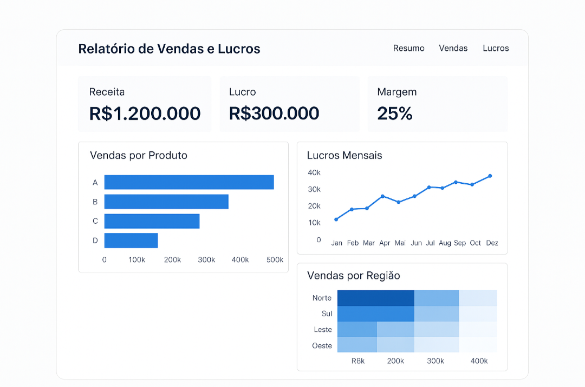

## 🧭 Relatório de Vendas e Lucros — Projeto Data Analytics (CDS)

Foco: Business Intelligence • Data Analytics • Engenharia de Dados
Autor: Sérgio Santos

**Bootcamp Klabin - Excel e Power BI Dashboards**

---

## 🧭 Relatório de Vendas e Lucros — Projeto Data Analytics com Power BI (Simulado via Python) 

---

## 🎯 1. Problema de Negócio

A empresa apresentava crescimento no volume de vendas, porém com queda de margem e baixa previsibilidade de lucro. A diretoria não possuía uma visão integrada que respondesse rapidamente:

• Quais regiões são realmente lucrativas?

• Quais categorias de produtos drenam margem?

• Onde concentrar investimentos para maximizar o ROI?

A ausência dessa visibilidade levava a decisões baseadas em percepção, aumentando o risco financeiro e a ineficiência operacional.

---

## 📊 2. Baseline (Situação Anterior)

Antes deste projeto:

• As análises eram realizadas de forma manual e descentralizada, principalmente em Excel;

• Os relatórios apresentavam atraso médio de 7 a 10 dias;

• Não havia cálculo consistente de margem por região, produto ou perfil de cliente;

• As decisões estratégicas não consideravam eficiência logística nem rentabilidade real.

Este cenário foi utilizado como baseline para avaliar a evolução analítica entregue pela solução.

---

## 🧠 3. Objetivo do Projeto

Construir um diagnóstico analítico confiável e acionável, capaz de:

Identificar gargalos de margem e oportunidades de ganho;

Priorizar regiões e categorias mais rentáveis;

Traduzir dados operacionais em insights claros para tomada de decisão;

Demonstrar domínio técnico independente de ferramentas proprietárias.

---

## 🛠️ 4. Planejamento e Estratégia da Solução

A solução foi estruturada para simular um ambiente corporativo real de BI, reproduzindo o fluxo do Power BI com ferramentas de código aberto.

**Fluxo da solução:**

1. Extração de dados (CSV)

2. Limpeza e padronização dos dados

3. Modelagem dimensional (Star Schema)

4. Análise exploratória (EDA)

5. Geração de métricas e indicadores

6. Storytelling executivo

---

## 🧹 5. Limpeza e Qualidade dos Dados

Durante o processo de ETL:

Aproximadamente 4,8% dos registros com preços zerados ou inconsistentes foram removidos;

Campos categóricos foram padronizados (região, categoria, tipo de cliente);

Tipos de dados financeiros foram normalizados;

Foram aplicadas validações de integridade entre tabelas fato e dimensões.

Essa etapa garantiu confiabilidade nas métricas de lucro e margem.

---

## 🔍 6. Análise Exploratória (EDA)

Hipóteses avaliadas:

• Alto volume de vendas não implica maior lucro;

• Determinadas categorias concentram margem elevada;

• Clientes recorrentes geram maior lucro médio.

• Resultados: As hipóteses foram confirmadas, direcionando a análise para eficiência operacional e rentabilidade.

---

## 🗂️ 7. Preparação e Modelagem dos Dados

Os dados foram organizados em modelo Estrela (Star Schema):

Fato: Vendas

Dimensões: Produtos, Clientes, Regiões

Essa abordagem facilita:

• Escalabilidade analítica;

• Integração futura com ferramentas de BI;

• Performance em consultas e agregações.

---

## 📈 8. Principais Insights

• Região Sudeste: 42% das vendas e 47% do lucro → maior eficiência logística;

• Eletrônicos e Acessórios: margem superior a 20% → principal alavanca de crescimento;

• Clientes recorrentes: lucro médio 18% maior;

• Sazonalidade: crescimento consistente no segundo semestre.

---

## 💰 9. Business Performance (Impacto Financeiro)

Simulações baseadas no histórico indicam que:

Um aumento conservador de 2% na margem média representa aproximadamente R$ 480.000/ano em ganho financeiro;

A priorização de categorias de alta margem reduz risco operacional e aumenta o ROI.

O projeto converte métricas analíticas em impacto financeiro mensurável.

---

## 🚀 10. Solução em Produção (Visão)

Atualmente, o pipeline é executado localmente para fins analíticos.

Evoluções planejadas:

Automação do ETL via GitHub Actions;

Persistência dos dados em banco analítico;

Publicação de dashboards em ambiente web;

Bot no Telegram para alertas diários de KPIs.

---

## 🔮 11. Próximos Passos

Implementar modelo de previsão de vendas (Time Series);

Monitorar margem e lucro de forma contínua;

Integrar dados externos (campanhas, logística);

Versionar completamente o pipeline de dados.

---

## 🛠️ Tecnologias Utilizadas

• **Linguagem:** Python 3.11 (Pandas, NumPy, SciPy)

• **Visualização:** Plotly, Matplotlib, Seaborn

• **Banco de Dados / Consultas:** SQL

• **BI:** Power BI (referência de layout e UX)

• **Ambiente:** Jupyter Notebook, Git

---

## 💻 Requisitos de Hardware e Software

**Hardware**

• Processador Dual-core 2.0 GHz ou superior

• Memória RAM mínima: 8 GB (recomendado 16 GB)

• Armazenamento: 2 GB livres

**Software**

• Sistema Operacional: Windows 10+, Linux ou macOS

• Python 3.11 ou superior

• Jupyter Notebook ou JupyterLab

• Git

• Excel (opcional, apenas para visualização complementar)

---

## 🏗️ Estrutura do Repositório

 

---

## 📂 Descrição dos Arquivos

### 📁 **assets/**
- **mockup_dashboard.png** — Imagem ilustrativa do painel de vendas e lucros (simulação do Power BI).

---

### 📁 **data/**
- **vendas.csv** — Fato principal com registros de vendas, quantidades e preços unitários.  
- **produtos.csv** — Dimensão contendo produtos e categorias.  
- **clientes.csv** — Dimensão com informações demográficas e de segmento.  
- **regioes.csv** — Dimensão geográfica.  
- **dicionario_dados.xlsx** — Dicionário detalhado de todas as colunas e tipos de dados.

---

### 📁 **src/**
- **etl_limpeza_dados.py** — Script Python para limpeza e padronização dos dados.  
- **etl_transformacoes.sql** — Script SQL para criação de tabelas analíticas e agregações.  
- **export_powerquery_steps.txt** — Equivalente textual ao Power Query (documentação dos passos de transformação).

---

### 📁 **notebooks/**
- **analise_vendas_lucros.ipynb** — Análise principal dos indicadores de vendas, margens e tendências.  
- **simulacao_dashboard_sem_powerbi.ipynb** — Simulação visual do dashboard utilizando Plotly e Matplotlib.  
- **exploracao_estatistica.ipynb** — Estudo exploratório dos dados com correlações e distribuições.

---

### 📁 **docs/**
- **RelatorioCriativo.pbix** — Relatório original criado no Power BI (referência do projeto).  
- **ProjetoDataAnalyticsPowerBi.docx** — Documento explicativo do desafio e metodologia.  
- **ementa_aulas.md** — Ementa das aulas que inspiraram o projeto.  
- **analise_estatistica.md** — Detalhamento das análises estatísticas aplicadas.  
- **processo_desenvolvimento.md** — Guia de desenvolvimento e integração das etapas.  
- **guia_didatico_sem_powerbi.md** — Explicação passo a passo de como reproduzir o dashboard sem Power BI.  
- **diagrama_estrutura_pastas.png** — Diagrama visual da estrutura do repositório.

---

### 📁 **tests/**
- **verificacao_dados.md** — Checklist de integridade e consistência dos dados.  
- **checklist_layout.md** — Itens de verificação do layout e UX do dashboard.  
- **relatorio_ajustes.xlsx** — Relatório de ajustes realizados durante o desenvolvimento.

---

## ▶️ Como Executar o Projeto

 **Clonar o repositório**
git clone https://github.com/Santosdevbjj/relatoVendasLucros.git

 **Criar ambiente virtual**
python -m venv venv
source venv/bin/activate  # Linux/macOS
venv\\Scripts\\activate     # Windows

 **Instalar dependências**
pip install -r requirements.txt

Abra o Jupyter Notebook e execute:

notebooks/analise_vendas_lucros.ipynb

notebooks/simulacao_dashboard_sem_powerbi.ipynb

notebooks/exploracao_estatistica.ipynb

---

## 🧠 Conclusão:

Este projeto demonstra como Data Analytics aplicado ao negócio reduz incertezas, direciona investimentos e melhora resultados financeiros — mesmo sem o uso de ferramentas proprietárias.

Mais do que gráficos, a solução entrega clareza, priorização e impacto estratégico.

---

✨ **Autor**

Sérgio Santos

---

📚 **Licença**

Este projeto é distribuído sob a licença MIT License — uso livre para fins educacionais e profissionais.

---

**Contato:**

 

---

